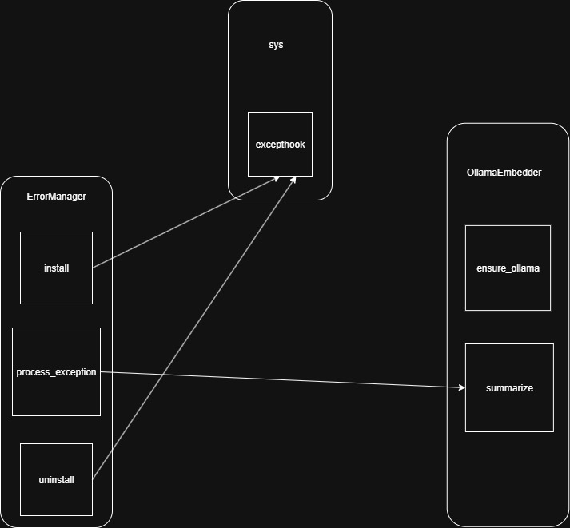

# pyerrorhelper

> 🧠 AI-enabled Python library for **runtime error explainability**.

---

## 📖 Description

`pyerrorhelper` is a Python library that brings **AI-powered error explainability** into your runtime environment.

### Why?
Developers typically use AI **before** running code (for generation) or **after** running code (for debugging).
This package enables AI **during execution**, so your running Python programs can leverage AI-driven insights in real time.

### Key Objectives
- **Runtime AI integration** – Make AI available inside the running program (starting with error explainability).
- **Retrofit older systems** – Allow existing Python systems to adopt AI workflows with minimal changes.
- **Free & local AI models** – Works with free AI solutions - using [Ollama](https://www.ollama.com).

---

## Architecture Diagram



## ⚙️ Installation

1. **Install Python**
   Download and install from [python.org](https://www.python.org/downloads/).

2. **Install pyerrorhelper**
   ```bash
   pip install pyerrorhelper
   ```

3. **Usage**
```
from pyerrorhelper import ErrorManager

if __name__ == "__main__":
    error_manager = ErrorManager()
    error_manager.install()

    def cause_error():
        return 1 / 0  # This will raise a ZeroDivisionError

    cause_error()

    error_manager.uninstall()
```
## 👨‍💻 About Me

Name: Shikhar Aditya

Email: satyamshikhar@gmail.com

Github Repo Link: [pyerrorhandler](https://github.com/Satyamaadi/pyerrorhelper)

GitHub Personal Profile: [Satyamaadi](https://github.com/Satyamaadi)

## 🤝 Contributing

Contributions are welcome! Feel free to fork, open issues, or submit pull requests.
